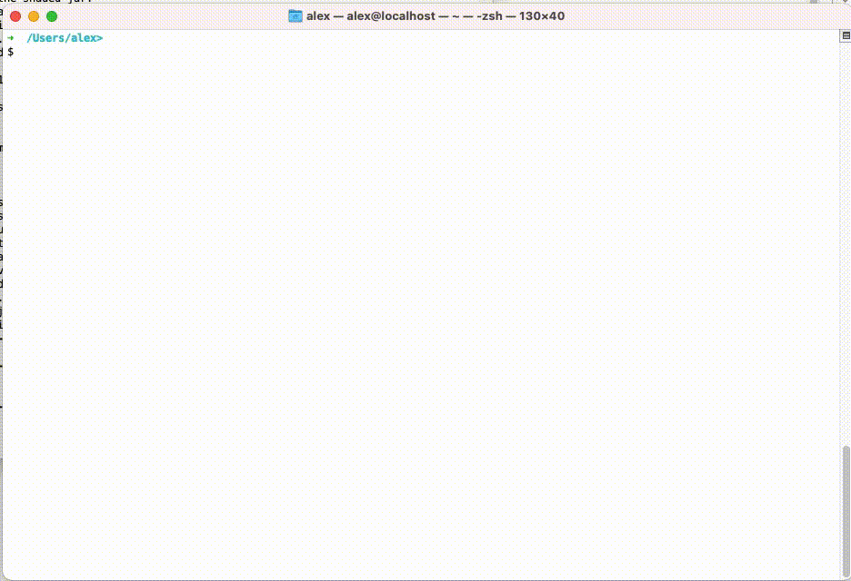

# Task1: 模拟文件系统
使用一个固定2G大小的文件模拟磁盘，实现文件系统FAT16X，并实现简易的shell控制台以进行文件操作。

## 设计文档
[FAT16X规格说明](./docs/fat16x-spec.md) 

## 任务描述
- 使用固定2G大小的文件模拟磁盘，关键是读取扇区和写入扇区两个接口。以java为例：
```java
interface IDisk {
    /**
     * 读取一个指定扇区的数据。
     * 
     * @param sectorIdx 扇区索引，起始索引为0，终止索引为 {@code sectorCount()-1}
     * @return 扇区数据，返回的字节数组长度必须等于{@code sectorSize()}
     */
    byte[] readSector(int sectorIdx);

    /**
     * 写一个指定扇区。
     * 
     * @param sectorIdx 扇区索引，起始索引为0，终止索引为 {@code sectorCount()-1}
     * @param sectorData 待写入的数据. 长度必须等于{@code sectorSize()}
     */
    void writeSector(int sectorIdx, byte[] sectorData);

   /**
     * 磁盘每个扇区的大小，固定为512字节
     */
    default int sectorSize() {
      return 512;
    }

    /**
     * 磁盘扇区数量，固定为 2G/512
     */
    default int sectorCount() {
      return 2 * 1024 * 1024 * 1024L / 512;
    }
}
```
- 基于以上模拟磁盘，实现文件系统FAT16X（文档参考`设计文档`一节）
- 实现简易shell，从stdin获取输入并执行（程序启动后随即进入shell）
- 实现以下命令，并支持输出重定向

| 命令  | 说明   |
| ---- | -----  |
| format     | 格式化磁盘 |
| mkdir      | 创建目录   |
| touch      | 创建文件   |
| ls         | 显示当前目录下的所有文件和子目录 |
| cd         | 切换目录   |
| pwd        | 查看当前路径   |
| echo       | 回显内容   |
| cat        | 显示文件内容   |

## 交付物
- 源代码
- 可执行程序

交付方式：可访问的`git repo` （公司内外均可）

## 其他说明
- 暂不需要支持多用户
- 暂不需要支持权限
- 暂不需要支持并发

## 验收要求
- 文件数据符合`设计文档`中规范要求
- 相关命令操作顺畅、没有明显bug
- 时间要求：<= 4周, (超过4周还需继续完成，但当前任务记0分)
- 语言要求：不限
- 抽象分层是否优雅
- 代码实现是否简洁
## 辅助工具
按二进制查看文件内容工具： [xxd](https://www.oreilly.com/library/view/linux-pocket-guide/9780596806347/re28.html)，比如：

```shell
$ xxd -s 0 -l 512 mos-disk
00000000: eb3c 906d 6f73 2d6e 696c 0002 0040 0001  .<.mos-nil...@..
00000010: 0203 f0ff fffa 0100 003f 0000 0000 0000  .........?......
00000020: ffff ffff 0000 0000 0000 0000 0000 0000  ................
00000030: 0000 0000 0000 4641 5431 3658 0000 0000  ......FAT16X....
00000040: 0000 0000 0000 0000 0000 0000 0000 0000  ................
00000050: 0000 0000 0000 0000 0000 0000 0000 0000  ................
00000060: 0000 0000 0000 0000 0000 0000 0000 0000  ................
00000070: 0000 0000 0000 0000 0000 0000 0000 0000  ................
00000080: 0000 0000 0000 0000 0000 0000 0000 0000  ................
00000090: 0000 0000 0000 0000 0000 0000 0000 0000  ................
000000a0: 0000 0000 0000 0000 0000 0000 0000 0000  ................
000000b0: 0000 0000 0000 0000 0000 0000 0000 0000  ................
000000c0: 0000 0000 0000 0000 0000 0000 0000 0000  ................
000000d0: 0000 0000 0000 0000 0000 0000 0000 0000  ................
000000e0: 0000 0000 0000 0000 0000 0000 0000 0000  ................
000000f0: 0000 0000 0000 0000 0000 0000 0000 0000  ................
00000100: 0000 0000 0000 0000 0000 0000 0000 0000  ................
00000110: 0000 0000 0000 0000 0000 0000 0000 0000  ................
00000120: 0000 0000 0000 0000 0000 0000 0000 0000  ................
00000130: 0000 0000 0000 0000 0000 0000 0000 0000  ................
00000140: 0000 0000 0000 0000 0000 0000 0000 0000  ................
00000150: 0000 0000 0000 0000 0000 0000 0000 0000  ................
00000160: 0000 0000 0000 0000 0000 0000 0000 0000  ................
00000170: 0000 0000 0000 0000 0000 0000 0000 0000  ................
00000180: 0000 0000 0000 0000 0000 0000 0000 0000  ................
00000190: 0000 0000 0000 0000 0000 0000 0000 0000  ................
000001a0: 0000 0000 0000 0000 0000 0000 0000 0000  ................
000001b0: 0000 0000 0000 0000 0000 0000 0000 0000  ................
000001c0: 0000 0000 0000 0000 0000 0000 0000 0000  ................
000001d0: 0000 0000 0000 0000 0000 0000 0000 0000  ................
000001e0: 0000 0000 0000 0000 0000 0000 0000 0000  ................
000001f0: 0000 0000 0000 0000 0000 0000 0000 55aa  ..............U.
```

## 功能参考



## 参考lib
命令行工具
- [picocli - a mighty tiny command line interface](https://picocli.info/)
- [A Commander for modern Go CLI interactions](https://cobra.dev/)
