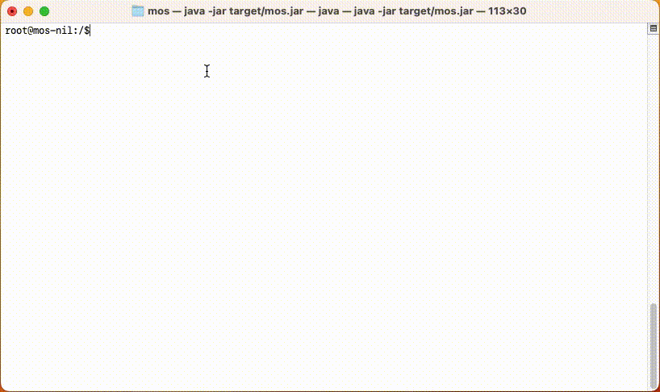

# 系统与应用独立（final）
本次任务是第一期训练营的收官任务，任务要求跟前3个有所不同，除了必须的代码实现外，还需要结合过往的任务和辅导回答几个问题。

从任务一到任务三，我们从零开始实现了一个简单的文件系统、终端操作以及SSH支持，虽然所有的功能和特性都集中在一个可执行程序中，
但相信大家都应该能够体会每一层都应该有每一层的抽象，每一层都应该有自己的职责，这样才能够让整个系统更加稳定、易于维护。

不过，都集中于一个可执行程序中虽然有利于快速迭代，但显然跟现实有很大的不同，一个完整的操作系统不可能只有一个可执行程序，也做不到所有的功能都内置在一个可执行程序中。

所以，接下来我们需要将应用层的功能进行抽离，让系统和应用进行分离。（所谓分离的意思是，每一个应用都是一个独立的程序，被持久化在MOS的文件系统中，可以独立调起，不再内置于MOS中）

## 任务描述
### 问答任务
- MOS的实现分为了哪几层？每一层的职责是什么？
- 如果要支持多文件系统，你会如何设计？
- 如果要支持多磁盘挂载，你会如何设计？
- 如果要将系统与应用进行分离，你会如何设计？系统与应用的交接面是什么？
- 现有的实现里，哪些功能属于应用层逻辑，可以抽离出来？如何抽离？

### 代码任务
- 对任务三的codebase打个tag，命名为`tag-task3`
- 结合前面的问答，至少完成一个功能的抽离

## 交付物
- 问题回答
- 源代码
- 可执行程序

交付方式：同任务一的`git repo` ， 外加一个`README.md`文件，里面包含了对问答任务的回答。

## 其他说明
- 暂不需要支持权限

## 代码验收要求
- 相关命令操作顺畅、没有明显bug
- 时间要求：2023.11.30前
- 语言要求：同任务一
- 基础抽象是否稳定
- 代码实现是否简洁

## 功能参考

